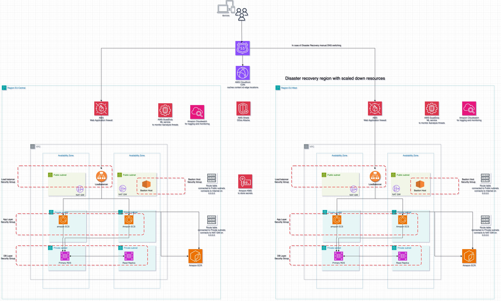

# Deployment README

## Overview

This README provides guidance on deploying the architecture consisting of an ECS (Elastic Container Service) cluster, RDS (Relational Database Service) instance, ALB (Application Load Balancer), and associated resources.

## Terraform Creation Steps

1. Install Terraform: Download and install Terraform from the official website: [Terraform Downloads](https://www.terraform.io/downloads.html).
2. Set Up AWS Credentials: Configure AWS CLI or set AWS access keys as environment variables.
3. Initialize Terraform: Navigate to the directory containing your Terraform configuration files and run `terraform init`.
4. Review and Customize Configuration: Modify the Terraform configuration files (`*.tf`) to match your requirements, including variables, resource settings, and dependencies.
5. Plan Deployment: Run `terraform plan` to preview the changes Terraform will make to your infrastructure.
6. Apply Changes: Execute `terraform apply` to apply the Terraform configuration and create/update AWS resources.
7. Review Output: After successful deployment, Terraform will display outputs containing useful information such as resource IDs and endpoints.
8. Verify Deployment: Validate that the deployed resources match your expectations and are functioning correctly.
9. Destroy Infrastructure (Optional): To tear down the infrastructure, run `terraform destroy` after verifying the deployment.
# Application Architecture

## Deployment Steps:

### VPC Setup:

1. Create a VPC with the specified CIDR block.
2. Attach an internet gateway to enable internet access.
3. Define public and private subnets with associated route tables.
4. Configure NAT gateway for private subnet internet access.
5. Implement security groups for ECS servers, database, and ALB.

### ECS Setup:

1. Provision an ECS cluster.
2. Define ECS task definition specifying container image, resource requirements, and environment variables.
3. Create an ECS service with desired count and networking configurations.
4. Configure an Application Load Balancer (ALB) to route traffic to ECS tasks.
5. Set up auto-scaling for ECS tasks based on CPU utilization.

### RDS Setup:

1. Define an RDS instance with specified configurations including engine, instance class, and allocated storage.
2. Configure multi-AZ deployment for high availability.
3. Enable automated backups for data durability and point-in-time recovery.
4. Optionally, add read replicas for scalable read-heavy workloads.

## Design Decisions:

### Public and Private Subnets:

- Subnet1 is designated as public for resources requiring internet access, like ALB.
- Subnet2 is marked private to host backend services like the database, ensuring enhanced security by restricting direct internet access.

### Security Groups:

- ECS Servers Security Group: Allows HTTP (port 80) and HTTPS (port 443) traffic only from ALB Security Group, enhancing security.
- Database Security Group: Permits PostgreSQL (port 5432) traffic from ECS Servers Security Group to facilitate communication between ECS tasks and the database.
- ALB Security Group: Allows HTTP and HTTPS traffic from anywhere, ensuring accessibility to the ALB.

### ECS on Fargate:

- **Container Orchestration**: ECS on Fargate was chosen as the container orchestration platform due to its serverless nature, eliminating the need to manage underlying infrastructure and allowing focus on application development.
- **Resource Efficiency**: Fargate provides resource efficiency by dynamically allocating resources to containers based on their requirements, optimizing resource utilization and reducing costs.
- **Scalability**: Fargate enables seamless scaling of containers based on workload demands, ensuring high availability and performance of applications without manual intervention.
- **Simplified Deployment**: By abstracting away the infrastructure layer, ECS on Fargate simplifies the deployment process, allowing rapid deployment and updates of containerized applications with minimal operational overhead.
- **Integrated Networking**: Fargate integrates with AWS networking services, enabling seamless communication between containers and other AWS services while providing security through VPC isolation and security groups.

### Auto-scaling:

- Auto-scaling is enabled for ECS tasks to dynamically adjust task count based on CPU utilization, ensuring optimal resource utilization and performance.

### RDS Automated Backup:

- Automated backups are enabled for RDS instances to ensure data durability and facilitate point-in-time recovery in case of data loss or corruption.

### RDS Multi-AZ Deployment:

- RDS instances are deployed across multiple availability zones (AZs) to enhance fault tolerance and ensure high availability of database services.

### RDS Read Replica:

- Read replicas are configured for RDS instances to offload read-heavy workloads and improve database performance.

## Future Improvements:

- **AWS GuardDuty**: Implement AWS GuardDuty for continuous security monitoring and threat detection.
- **AWS Shield and AWS WAF**: Enhance security by implementing AWS Shield for DDoS protection and AWS WAF for web application firewall.
- **Cloud CDN**: Implement a content delivery network (CDN) for improved content delivery and performance optimization.
- **Disaster Recovery Environment**: Set up a disaster recovery environment in another region with a less scaled version for business continuity and data redundancy.
- **Encryption for Secrets**: Implement encryption for secrets and passwords using AWS Key Management Service (KMS) to ensure sensitive data is securely stored and managed.

## Assumptions:

- Single Region Deployment: The configuration assumes deployment within a single AWS region (e.g., eu-central-1).
- Minimalistic Access Requirements: The security configurations prioritize security by granting minimum required access between components.
- Familiarity with AWS: Users deploying this architecture are assumed to have a basic understanding of AWS services and Terraform.

## Security Best Practices Implemented:

- **Least Privilege**: Security groups are configured to allow only necessary inbound and outbound traffic, following the principle of least privilege.
- **Multi-AZ Deployment**: RDS instances are deployed across multiple availability zones (AZs) for enhanced fault tolerance and reliability.
- **Automated Backups**: Automated backups are enabled for RDS instances to ensure data durability and facilitate point-in-time recovery.
- **Read Replica**: Read replicas are implemented to offload read-heavy workloads and improve database performance.
- **ECS on Fargate**: ECS tasks are orchestrated using Fargate, a serverless compute engine, reducing operational overhead and enhancing security.

By following these deployment steps and design decisions, the architecture ensures a secure, scalable, and well-structured environment for deploying web applications on AWS using ECS.
